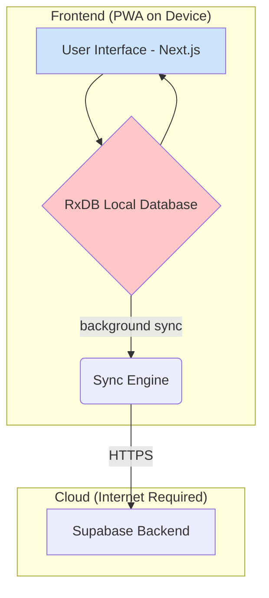

# System Architecture: The Unfailing POS

## 1. Guiding Principle: Reliability Above All

The architecture of Digital Reset POS is founded on a single, non-negotiable principle: **a business must never lose a sale due to technology failure**. Every decision, from the choice of the database to the deployment strategy, is optimized to ensure the POS system is **always available, always responsive, and completely independent of internet connectivity**.

This document outlines the technical blueprint that makes this possible, designed to be understood by business leaders, marketing teams, and the AI agents that will build and maintain the system.

## 2. The Three Layers of the System

Our architecture is composed of three distinct layers, each with a specific role. This separation of concerns ensures the system is robust, scalable, and easy to maintain.

| Layer | Primary Role | Key Technologies | Analogy |
| :--- | :--- | :--- | :--- |
| **1. The Local-First Frontend** | **Run the Business** | Next.js, **RxDB** | The local store itself. It has everything it needs to operate independently. |
| **2. The Cloud Backend** | **Sync & Backup** | **Supabase**, PostgreSQL | The central warehouse. It receives updates from stores and sends out new catalogs, but its unavailability doesn't stop a store from selling. |
| **3. The Integration Fabric** | **Connect to the World** | Supabase Functions | The shipping and receiving department. It handles communication with external partners like suppliers (Zoho) and online stores (Shopify). |

---

## 3. The Local-First Frontend: Your Digital Cash Register

The frontend is a Progressive Web App (PWA) that acts as the complete, self-contained POS terminal. It runs in a web browser on any device (iPad, PC, Android tablet) and is designed to be **100% functional offline**.

### The Secret Sauce: RxDB - The Onboard Database

The core of our offline-first strategy is **RxDB**, a powerful database that runs directly inside the web browser. Unlike competitors who merely cache a small amount of data, we run the entire operational database locally.

- **It's a Full Database, Not a Cache**: Every product, customer, and transaction is stored locally. The app reads and writes from this local database, resulting in instantaneous, sub-50ms interactions.
- **It's Always Available**: Because the database is on the device, it is completely immune to network failures.
- **It's Reactive**: The UI is automatically updated in real-time as data changes in the local database, creating a fluid and responsive user experience.

### High-Level Frontend Diagram

## 4. The Cloud Backend: The Central Source of Truth

The backend, powered by **Supabase**, serves as the central hub for data synchronization, backup, and administration. **Crucially, the frontend does not depend on the backend to be online to process sales.**

- **Data Storage (PostgreSQL)**: A robust PostgreSQL database acts as the ultimate source of truth for all data across all locations.
- **Authentication (Supabase Auth)**: Manages secure user login and permissions.
- **Background Sync**: The backend provides an API endpoint for the RxDB Sync Engine to push and pull changes. This process happens quietly in the background and never blocks the user.
- **Serverless Functions**: These are used for tasks that require a secure, server-side environment, such as processing payments or communicating with third-party integration partners.

## 5. The Integration Fabric: Connecting to Other Systems

No business is an island. Digital Reset POS is designed to connect seamlessly with the other tools businesses use.

- **Abstracted Connectors**: We use a provider model, where each integration type (e.g., `InventoryProvider`, `ECommerceProvider`) has a standard interface.
- **Specific Implementations**: We then create concrete connectors (e.g., `ZohoInventoryConnector`, `ShopifyConnector`) that implement these interfaces. This makes it easy to add new integrations in the future.
- **Server-Side Execution**: To protect sensitive API keys and manage complex logic, all third-party communication happens within secure Supabase Functions.

## 6. The Data Flow: How It All Works Together

1.  **A Cashier Makes a Sale (Offline)**: A cashier adds items to a cart and completes a sale. The transaction is written instantly to the local **RxDB database**. The UI updates, a receipt is printed. The entire process is completed in milliseconds, with zero reliance on the internet.

2.  **The Internet Returns**: The device reconnects to the internet. The **RxDB Sync Engine** wakes up in the background.

3.  **Background Sync**: The Sync Engine sends the new sales data to the **Supabase Backend**. It also pulls down any changes from the cloud, such as a product price update made by a manager in the back office.

4.  **Conflict Resolution**: What if the price of a product was changed in the back office while the cashier was selling it offline? The system handles this gracefully. The sale is recorded with the price at the time of the transaction. The product's price is then updated on the POS for future sales. This "last-write-wins" approach can be customized for different scenarios.

5.  **Integration Trigger**: The new sale in the Supabase backend triggers a **Supabase Function**. This function securely communicates with Zoho Inventory to update stock levels and with Zoho Thrive to award loyalty points to the customer.

This architecture ensures that the system is not just resilient, but also intelligent and interconnected, providing a seamless experience for both the user and the business.
