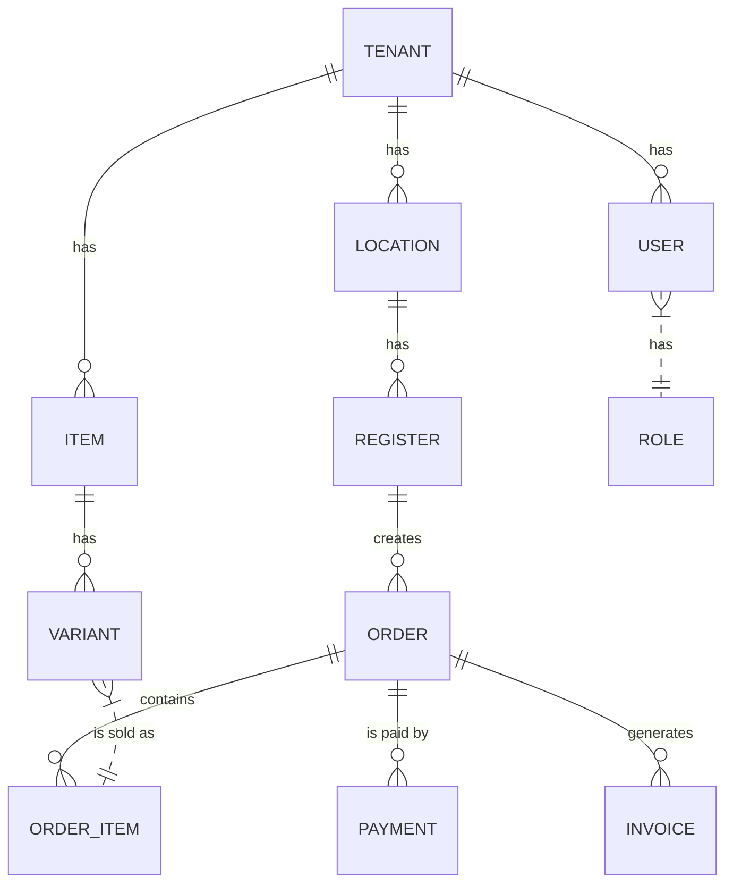

# Domain Model & Data Dictionary

## 1. Introduction

This document defines the core data structures, or "entities," that model the business concepts of the Digital Reset POS system. Understanding these entities and their relationships is crucial for developers, database administrators, and anyone seeking to understand how the system organizes information.

This serves as a plain-English data dictionary. For the technical SQL schema, please refer to the [Database Schema Reference](./../20-backend/03-database-schema-reference.md).

## 2. The Core Business Structure

These entities define the foundational structure of the businesses using our system.

| Entity | Description | Key Attributes |
| :--- | :--- | :--- |
| **Tenant** | Represents a single, distinct business or company. This is the top-level container for all other data, ensuring strict data isolation. | `id`, `name` |
| **Location** | A physical storefront or branch belonging to a Tenant. A business can have multiple locations (e.g., "Downtown Cafe," "Mall Kiosk"). | `id`, `tenant_id`, `name`, `address` |
| **Register** | A specific POS terminal or device within a Location. A location can have multiple registers (e.g., "Front Counter," "Drive-Thru Window"). | `id`, `location_id`, `name` |

---

## 3. People & Permissions

These entities manage who can access the system and what they are allowed to do.

| Entity | Description | Key Attributes |
| :--- | :--- | :--- |
| **User** | An individual employee or staff member who can log in. Every user belongs to a single Tenant. | `id` (from Auth), `tenant_id`, `full_name`, `email` |
| **Role** | A job function with a defined set of permissions (e.g., "Admin," "Cashier," "Manager"). | `id`, `name` |
| **User Role** | The link between a User and a Role. A user can have multiple roles (e.g., someone can be both a "Cashier" and a "Shift Supervisor"). | `user_id`, `role_id` |

---

## 4. The Product Catalog

These entities describe the products and services that a business sells.

| Entity | Description | Key Attributes |
| :--- | :--- | :--- |
| **Item** | The core product or service (e.g., "Coffee," "T-Shirt"). It acts as a template for its variations. | `id`, `tenant_id`, `name`, `description`, `category` |
| **Variant** | A specific version of an Item, with its own price and SKU (e.g., "Large Coffee," "Medium Blue T-Shirt"). This is what is actually sold. | `id`, `item_id`, `name`, `price`, `sku` |
| **Modifier** | An option that customizes an Item at the time of sale (e.g., "Extra Shot of Espresso," "Gift Wrapping"). Can have an additional cost. | `id`, `tenant_id`, `name`, `price` |

---

## 5. Sales & Transactions

These entities record the day-to-day sales activities.

| Entity | Description | Key Attributes |
| :--- | :--- | :--- |
| **Order** | The record of a single customer transaction. It is the container for all items purchased at one time. | `id`, `register_id`, `total`, `status` (`pending`, `completed`, `refunded`) |
| **Order Item** | A line item within an Order, linking a specific Variant to the Order. | `order_id`, `variant_id`, `quantity`, `price` (at time of sale) |
| **Payment** | The record of how an Order was paid for. An order can have multiple payments (e.g., split between cash and credit card). | `id`, `order_id`, `amount`, `method` (`cash`, `credit_card`) |
| **Invoice** | The official, legally compliant electronic invoice generated for an Order, particularly for e-invoicing regulations. | `id`, `order_id`, `fiscal_number`, `qr_code_url` |

---

## 6. Entity-Relationship Diagram (ERD)

This diagram illustrates how the core entities relate to one another.

### Key Relationships Explained:

-   A **Tenant** is the central entity. It owns **Locations**, **Users**, and the entire **Item** catalog.
-   A **Location** is a physical place that contains one or more **Registers**.
-   An **Order** is created at a specific **Register**. It is composed of one or more **Order Items**.
-   Each **Order Item** refers to a specific **Variant** of an **Item**, capturing the price and quantity at the moment of sale.
-   An **Order** can be settled by one or more **Payments**.
